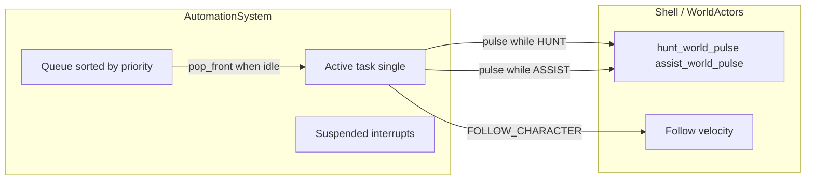

# Automation system: current vs target architecture

## What exists today (ground truth)

**Core scheduler** ([`systems/automation_system.gd`](systems/automation_system.gd)):

- **One runner = one automation brain**: each `runner_id` (typically a character id, plus optional `group:<id>` grouping) owns a **`_QueueState`**: **`queue`**, **`active`** task, **`suspended`** (interrupt stack), **`previous`** history, status log.
- **Priority only applies inside the backlog**: `enqueue_for` sorts `queue` by **`priority`** (higher first) + stable **`task_id`**. **`_tick_runner`** pulls **front after sort** (`pop_front`).
- **Active runs to completion** (or forever for long-lived types): nothing in **`_tick_runner`** compares a newly enqueued higher-priority task against **`st.active`** to preempt; **interrupt** is explicit (`interrupt_active` → pushes active to **`suspended`**) or task-specific world logic finishes the task (`HUNT` completes when **`kills_achieved`** ≥ target).

**World bridge** ([`ui/main_shell.gd`](ui/main_shell.gd) + **`world_actor.gd`**):

- **`hunt_world_pulse`** / **`assist_world_pulse`** per tick drive combat/movement targets while **`HUNT`** / **`assist`** are active.
- **`FOLLOW_CHARACTER`** stays active indefinitely; **`main_shell`** applies follow velocity toward **`target_character_id`** (partially delegated to **`_apply_follow_movement`**).
- **`IDLE`, `WAIT`, `HUNT` (draft task)** surfaced in automation tab UI with **Hold queue → Begin automation** (**`set_dispatch_held`** gates promotion from queue → active).

**Task enum already names your future domain** (`TaskType`):

- Tactical: **`HUNT`**, **`FOLLOW_CHARACTER`**, **`ASSIST_COMBAT`**, **`SUPPORT_ALLY`**
- Meta: **`COMPLETE_QUEST`**, **`SEARCH_LOOT`**, **`SELL_EXCESS_LOOT`**, **`SHARE_LOOT_GROUP`**, **`NAVIGATE_MAP`**, **`USE_PORTAL`**, **`MOVE_TO`**, **`INTERACT`**
- Today most non-HUNT/non-follow types **advance mostly via **`_sim_step`** countdown** (**simulated** completions) unless `sim_only`/world hooks extend them ([`_advance_task`](systems/automation_system.gd)).

**Supporting systems** partially present elsewhere:

- **Merchant** buys/sells** ([`systems/merchant_system.gd`](systems/merchant_system.gd)) — **not wired** from **`SELL_EXCESS_LOOT`** automation path yet.

---

## Gaps versus your stated end-state

| Goal | Current behavior | Needed architecture |
|------|------------------|------------------------|
| **“Higher priority preempts lower” continuously** | Priority orders **waiting** queue; **does not preempt** active when a new task arrives unless you **explicitly interrupt** or finish active | Policy layer: **`should_preempt(active, head_of_queue)`** and/or **`replan()`** each tick; optional **defer** current to **suspended** or **enqueue at front behind interrupt** rules |
| **One character AFK plays until Stop** | **Begin** clears dispatch hold for that **`runner_id`**; **Interrupt**/`clear` are manual—but **idle loop** relies on backlog + long tasks | Stable **lifecycle**: **Stop automation** clears active + optional **park** behavior; **`continuous`** partially exists for repeatable tasks |
| **A/B melee: hunt → quest → level → loot** | **`HUNT`** has real **`hunt_world_pulse`** + kill counter; **`COMPLETE_QUEST`** / **`SEARCH_LOOT`** are stub-timer unless extended | Concrete **completion contracts** per type (quest hooks from [`systems/quest_system.gd`](systems/quest_system.gd), loot goals from **`inventory`/world**, XP targets from **`CharacterProgressionSystem`**) + **travel** subgraph (**`NAVIGATE_MAP`/`USE_PORTAL`** + NavAgent) |
| **C: follow melee + buffs/heal under thresholds** | **`FOLLOW_CHARACTER`** infinite; **`SUPPORT_ALLY`** mostly log + sim ticks | Either **compound behavior** (“follow substrate + reactive overlay”) or **prioritized interrupt tasks** enqueued when ally vitals breach thresholds (**reactive evaluator** feeding **`enqueue_interruptible_high_priority`**—currently **stub** logic at lines 129–134) |
| **Vendors: sell unwanted, buy needs** | **`SELL_EXCESS_LOOT`** logs + completes on sim ticks; **MerchantSystem API** exists separately | Goal planner: **constraints** (keep list, junk rules), **`MOVE_TO`/interact merchant**, call **`merchant_system.sell_from_bag` / `buy_item`**, then return to backlog |

---

## Recommended target architecture (layered)

### 1. **Policy / scheduling layer** (new or tightly scoped module)

Sits beside or wraps **`AutomationSystem`**:

- **Inputs**: current **`active`**, **`queue`**, per-character vitals/skills (**registry + stats + equipment**).
- **Decisions**: 
  - **Preemption**: suspend interruptible **`active`** when **queued.head.priority > active.priority`** (respect **`interruptible`**, optional **grace period**).
  - **Reactive injection**: evaluator sees “ally HP &lt; 40%” → enqueue **`SUPPORT_ALLY`** with **`_priority`** above mundane **`HUNT`**, then trigger preempt.
- **Outputs**: **`enqueue_for`**, **`interrupt_active`**, **`resume`** (careful ordering).

Keep **`AutomationTask.data`** schema **versioned** (JSON-like dict already) so rules stay data-driven (**thresholds**, **ally ids**, **`merchant_id`**, **buy lists**).

### 2. **Task model: long-lived substrate vs reactive interrupts**

Avoid fighting **two never-ending tasks** (**FOLLOW + HUNT**) in one **`active`** slot:

- **Base loop** (**`FOLLOW_CHARACTER`** or **`HUNT`** or **`COMPLETE_QUEST`** chain**) as **`active`** interruptible backbone.
- **Short tasks** (**`SUPPORT_ALLY`**, **`SELL_EXCESS_LOOT`**, **`INTERACT`** buffer) preempt, run to completion, **resume suspended** backbone ( **`resume_suspended`** / repush to queue semantics already partly exist—but **ordering** today is **pop suspended LIFO**, may want **explicit “return to backbone” policy**).

### 3. **World executor** (thin, already started)

Maintain separation:

- **`AutomationSystem`** = state machine ticks + pulses.
- **`main_shell`** (or **`world_actor`** helpers) = pathing, LOS, spell selection, melee/missiles, **`MerchantSystem`** I/O during **`INTERACT`/`MOVE_TO`** at vendor.

Factor repeated patterns (**go to point**, **engage enemy id**, **use consumable**) into **tiny Command** structs inside **`task.data`** to avoid exploding **`main_shell`**.

### 4. **Reactive vital support** (`C`-style)

Dedicated **SupportEvaluator** pass (can live in **`main_shell._physics_process`** or a small **`Node`** child of shell):

- **Per tick** scan configured **pairs** (**supporter_runner** → **[ally_ids]**).
- **`if ally_hp_below` / `mana_below` / buff missing** ∧ **skills ready** ⇒ **`enqueue_interruptible_high_priority`** with **`support_action`** (**cast id**, **`item_id`**), **`priority`** from **`config Resource`**.

Ensure **`enqueue_interruptible_high_priority`** actually **`interrupt_active`** instead of **`pass`** (current stub [`automation_system.gd` L129–134](systems/automation_system.gd)).

### 5. **Economic automation**

**`SELL_EXCESS_LOOT` / BUY** tasks should become finite **pipelines**:

1. **`Decision`**: what to sell (**inventory tags / junk heuristic**).
2. **`NAVIGATE_MAP`/`MOVE_TO`**: merchant entity id (when world has vendor nodes).
3. **`INTERACT`**: transactional calls into [**`MerchantSystem`**](systems/merchant_system.gd).

### 6. **UI surfaces** ([`main_shell`** Panel D Automation + queue rows](ui/main_shell.tscn))

- Expose **`priority`** and **`interruptible`** per queue row (**already echoed in snapshots** [`main_shell`](ui/main_shell.gd) ~priority display).
- Add **preset templates** (melee grinder / follower / support thresholds) serialized as **`Resource`**.
- Tie **runner** (**Panel E**) to **explicit character id** semantics (already loosely done).

---

## Suggested phased delivery

1. **Scheduler correctness**: implement real **`enqueue_interruptible_high_priority`**, optional **priority preemption** path; add tests via [`tests/test_harness.gd`](tests/test_harness.gd).
2. **Reactive support MVP**: thresholds + **one** buff/heal routing on **`assist_world_pulse`** or new **`support_pulse`**, interrupt then resume backbone.
3. **Quest/loot linkage**: replace sim-only **`COMPLETE_QUEST`/`SEARCH_LOOT`** with **real completion predicates**.
4. **Vendor loop**: **MOVE_TO vendor + INTERACT** + **`merchant_system`**.
5. **Polish UX**: presets, clearer **Stop**/clear semantics, observability (**status_logged** tuning).

---

## Files that will evolve most

| File | Role |
|------|------|
| [`systems/automation_system.gd`](systems/automation_system.gd) | Preemption helpers, **`enqueue_interruptible_high_priority`**, optional **`tick`** policy hooks |
| [`ui/main_shell.gd`](ui/main_shell.gd) | pulses, movement, eventual **SupportEvaluator**, vendor interaction |
| New `systems/automation_policy.gd` (optional) | keep **`AutomationSystem`** lean |
| New `resources/automation_profile.tres`** pattern | thresholds, ally links, merchant ids |
| [`systems/merchant_system.gd`](systems/merchant_system.gd) | transactional automation bridge |
| [`systems/quest_system.gd`](systems/quest_system.gd) | task completion predicates |
