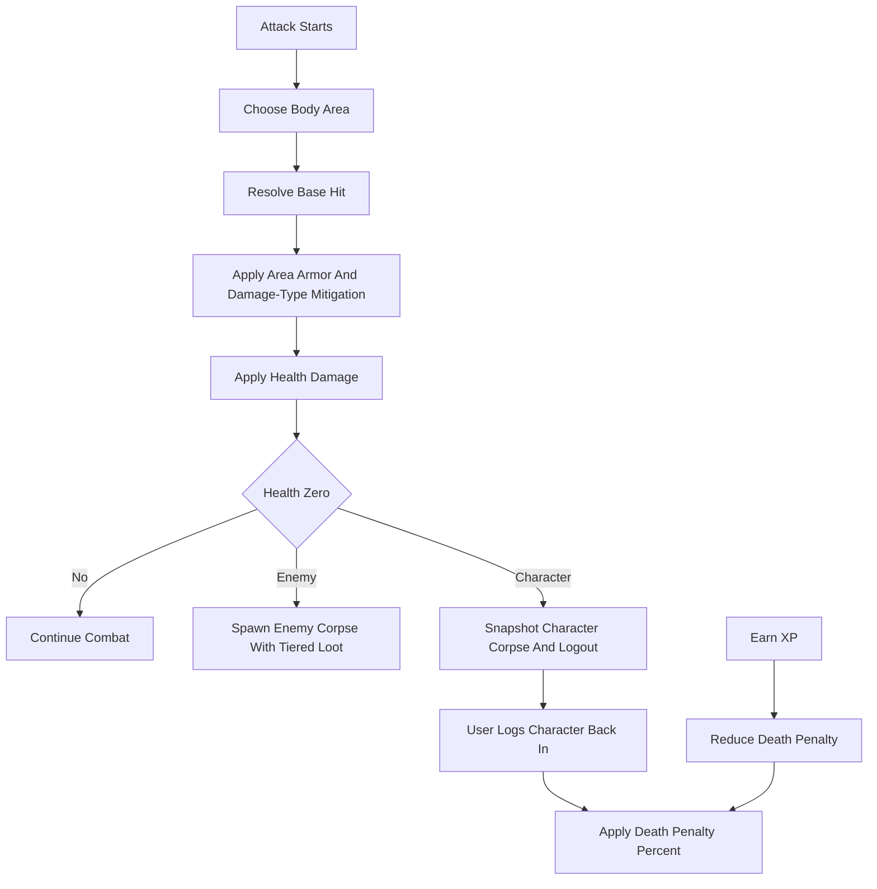

# Combat, Death, Loot, And Itemization Plan

## Ground Truth
- Combat math is centralized in [`systems/combat_system.gd`](D:/Projects/Cursor/niceShoes/systems/combat_system.gd), especially `resolve_melee_hit()` and `apply_vitals_damage()`.
- Characters persist vitals, XP, login state, and `meta` in [`systems/character_data.gd`](D:/Projects/Cursor/niceShoes/systems/character_data.gd).
- Inventory cells currently store only `{ item_id, quantity }` in [`systems/inventory_system.gd`](D:/Projects/Cursor/niceShoes/systems/inventory_system.gd), while equipment stores static `item_id`s in [`systems/equipment_system.gd`](D:/Projects/Cursor/niceShoes/systems/equipment_system.gd).
- Loot and corpse support exists but is skeletal: [`systems/loot_system.gd`](D:/Projects/Cursor/niceShoes/systems/loot_system.gd) returns no drops and [`systems/corpse_loot_system.gd`](D:/Projects/Cursor/niceShoes/systems/corpse_loot_system.gd) stores corpse bags without scene/UI integration.
- XP gains already flow through [`systems/character_progression_system.gd`](D:/Projects/Cursor/niceShoes/systems/character_progression_system.gd), which is the correct hook for fading death penalty while still awarding full XP.

## Target Flow

## Phase 1: Combat Contract And Body Areas
- Add a combat balance/config Resource, likely [`data/combat_balance_config.gd`](D:/Projects/Cursor/niceShoes/data/combat_balance_config.gd), with body areas: `head`, `shoulders`, `chest`, `waist`, `legs`, `feet`, `hands`.
- Add area selection to [`systems/combat_system.gd`](D:/Projects/Cursor/niceShoes/systems/combat_system.gd): start with weighted or uniform selection, returning `target_area` in the hit result for logging/inspect.
- Add base unarmed cadence: 5 seconds per melee attack at 10 ability / 10 reflexes, exposed as config and returned through effective stats as `melee_attack_interval_sec` or `attack_speed_multiplier`.
- Update combat consumers in [`ui/main_shell.gd`](D:/Projects/Cursor/niceShoes/ui/main_shell.gd) and [`scripts/combat_test_enemy.gd`](D:/Projects/Cursor/niceShoes/scripts/combat_test_enemy.gd) to pass/consume the enriched result.
- Enforce no character-vs-character damage by disabling the party-target offensive spell damage path while keeping support spells valid.

## Phase 2: True Item Instances
- Add [`systems/item_instance_system.gd`](D:/Projects/Cursor/niceShoes/systems/item_instance_system.gd) to own `instance_id -> rolled item data` and serialize/deserialize all instances.
- Add [`data/item_instance.gd`](D:/Projects/Cursor/niceShoes/data/item_instance.gd) or a typed dictionary schema for instance fields: template `item_id`, loot tier, category/type, magic flag/effects, equipment requirements, value modifiers, burden, armor level, damage, attack speed, per-damage-type armor ratings, and inspect display fields.
- Extend [`data/item_definition.gd`](D:/Projects/Cursor/niceShoes/data/item_definition.gd) from static item definitions into templates: category, item type, base tier range, equippable body slot, skill requirement kind, base armor/damage/value/burden.
- Migrate inventory, equipment, merchant, corpse, ground drops, save/load, and inspect code to accept cells keyed by `instance_id` while preserving compatibility for old `{ item_id, quantity }` cells during load and tests.
- Keep stackable consumables/readables as item instances per stack, with no random affixes unless the generator marks them special.

## Phase 3: Equipment Stats And Area Mitigation
- Map attack areas to equipment slots in [`scripts/equipment_schema.gd`](D:/Projects/Cursor/niceShoes/scripts/equipment_schema.gd): head, shoulders, chest, waist, legs, feet, hands.
- Update [`systems/equipment_system.gd`](D:/Projects/Cursor/niceShoes/systems/equipment_system.gd) so equipping uses instance IDs, validates requirements against character skills, and retrieves rolled modifiers from `ItemInstanceSystem`.
- Update [`systems/stats_system.gd`](D:/Projects/Cursor/niceShoes/systems/stats_system.gd) to apply weapon/accessory modifiers to attack speed, melee/missile/magic combat, melee/missile defense, arcane conversion, spell extra damage chance, and death penalty.
- Add armor mitigation in [`systems/combat_system.gd`](D:/Projects/Cursor/niceShoes/systems/combat_system.gd): after base damage, inspect the target area’s equipped armor instance and reduce by armor level plus damage-type rating.
- Update item inspect in [`ui/main_shell.gd`](D:/Projects/Cursor/niceShoes/ui/main_shell.gd) to display rolled stats, requirements, magic effects, value modifiers, armor ratings, and damage/attack-speed modifiers.

## Phase 4: Death, Corpse, Logout, And Penalty
- Add death handling to the character damage path in [`systems/combat_system.gd`](D:/Projects/Cursor/niceShoes/systems/combat_system.gd) or a small [`systems/death_system.gd`](D:/Projects/Cursor/niceShoes/systems/death_system.gd): when health reaches 0, emit a death signal or return a death result.
- For character death: create a corpse snapshot via [`systems/loot_system.gd`](D:/Projects/Cursor/niceShoes/systems/loot_system.gd), leave the corpse in the world, set `is_logged_in = false`, refresh world actors, and require manual login.
- Store death penalty on character data as explicit fields or stable `meta` keys: current percent/debt, capped at 35%, starting at 5% per death unless configured otherwise.
- On login after death, keep health at a minimal safe value and apply death penalty to effective attributes/stats via [`systems/stats_system.gd`](D:/Projects/Cursor/niceShoes/systems/stats_system.gd).
- In [`systems/character_progression_system.gd`](D:/Projects/Cursor/niceShoes/systems/character_progression_system.gd), keep full XP awards intact and also reduce the separate death-penalty value on every earned XP event.

## Phase 5: Enemies And Loot Tiers
- Extend [`scripts/combat_test_enemy.gd`](D:/Projects/Cursor/niceShoes/scripts/combat_test_enemy.gd) or introduce enemy data resources with level, attributes, vitals, derived stats, loot tier, XP reward, and randomized difficulty bands.
- Add level-to-tier logic in loot config: levels 1-5 => tier 1, 96-100 => tier 20.
- Update enemy inspect in [`ui/main_shell.gd`](D:/Projects/Cursor/niceShoes/ui/main_shell.gd) to show level, attributes, and vitals.
- Replace enemy `queue_free()` death-only behavior with corpse creation, loot generation, XP award, and then removal/replacement by a corpse node.

## Phase 6: Loot Tables, Corpse UI, And Item Creation Sources
- Add loot-table Resources under [`data/`](D:/Projects/Cursor/niceShoes/data) with 20 tiers and pools for armor, weapons, accessories, clothing, consumables, readables, and junk.
- Implement item creation in a dedicated generator, likely [`systems/item_generation_system.gd`](D:/Projects/Cursor/niceShoes/systems/item_generation_system.gd): merchant load, character creation, corpse creation, and chest/openable loot.
- Implement the requested roll rules: 4% magic on wearable items; jewelry/metal/fabric value modifiers; armor metal armor-level bonus; melee weapon metal damage bonus; caster/accessory/clothing value rules.
- Add corpse scene and one-minute fade/despawn under [`maps/`](D:/Projects/Cursor/niceShoes/maps) or a reusable scene under [`ui/`](D:/Projects/Cursor/niceShoes/ui) plus world placement from death handlers.
- Add corpse loot UI opened by right click, Panel B.c, and automation; it should call [`systems/corpse_loot_system.gd`](D:/Projects/Cursor/niceShoes/systems/corpse_loot_system.gd) and respect trade range.

## Test Plan
- Extend [`tests/test_harness.gd`](D:/Projects/Cursor/niceShoes/tests/test_harness.gd) with focused tests for: body-area selection output, armor mitigation by area/damage type, no character-vs-character damage, death logout/corpse creation, death penalty stacking/fading with full XP retained, item instance save/load, equipment requirement checks, loot tier mapping, randomized item roll ranges, merchant generated stock, and corpse loot transfer/fade.
- Run the headless harness after each vertical slice and fix parse/runtime errors before proceeding to the next slice.

## Risk Controls
- Preserve compatibility for existing static `item_id` inventory/equipment/save data until tests confirm migration.
- Keep formulas in Resources/config scripts, not UI scripts.
- Keep the first implementation vertical: one enemy death creates one corpse with tiered generated loot, one armor piece mitigates one body area, one death penalty stack fades from XP.